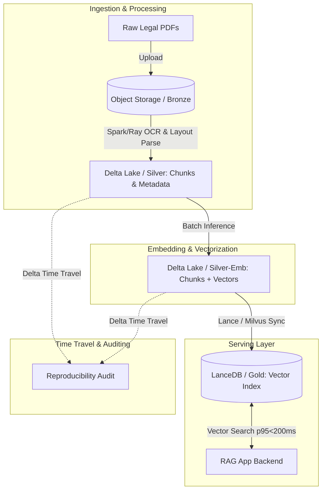

# Architecture Brief: Multimodal RAG over a 10M-Document Legal Corpus

## 1. Problem Statement
A Vietnamese law firm requires a Retrieval-Augmented Generation (RAG) system operating over 10 million legal PDFs (encompassing text, scanned images, and tables), roughly translating to 30 billion tokens of chunked data. The system faces stringent constraints: 
1. **Search latency** must be p95 < 200 ms. 
2. **Lifecycle & Upgrades**: Embeddings will be regenerated at least twice over the product's lifespan as models improve. 
3. **Strict Reproducibility**: Legal compliance dictates that when a court case cites a document version, the exact retrieval result must be reproducible up to 5 years later. 

This is a hard problem because balancing the massive scale of vector search (< 200 ms over ~60M chunks) with the immutable, time-travel requirements of legal reproducibility usually creates opposing forces between the serving layer and the storage layer.

## 2. Architecture Diagram

**Layout Summary**:
*   **Bronze**: Immutable raw PDF files and OCR outputs in S3/MinIO.
*   **Silver**: Delta Lake tables containing parsed chunks, document hierarchy, bounding boxes, and URIs to images.
*   **Silver-Embeddings**: Delta Lake tables appending the dense vectors (e.g., 768d or 1536d) to the chunks. 
*   **Gold**: LanceDB (or a dedicated vector database) built from Silver-Embeddings, optimized for ultra-fast ANN search.

## 3. Key Decisions & Trade-offs

### Decision 1: Table Format for Source of Truth (Delta Lake vs Lance)
*   **I chose Delta Lake** as the central storage (Silver) for chunks and embeddings.
*   **I rejected Lance as the *primary* long-term storage** because while Lance is heavily optimized for fast vector scans, Delta's ecosystem for ACID transactions, robust schema evolution, and Time Travel history retention is more mature and critical for the 5-year reproducibility requirement. 
*   **I rejected PostgreSQL/pgvector** because storing and snapshotting 30 billion tokens (~60-100 million rows of 1536d floats) with 5-year historical versioning would overwhelm a traditional RDBMS and become prohibitively expensive.

### Decision 2: Serving Vector Index Choice (HNSW vs IVF-PQ)
*   **I chose IVF-PQ (via LanceDB / DiskANN)** for the Gold serving layer. 
*   **I rejected strictly in-memory HNSW** because loading ~60 million 1536d vectors into RAM requires hundreds of gigabytes of expensive memory. 
*   **I rejected Flat/Exact Search** because it cannot possibly meet the p95 < 200 ms latency requirement over this dataset size. IVF-PQ provides a predictable disk-backed/RAM-hybrid vector search that fits within budget while satisfying the latency constraint.

### Decision 3: Embedding Lifecycle & Versioning
*   **I chose to append new embedding model outputs as separate columns** (e.g., `vector_v1_clip`, `vector_v2_bge`) within the Delta Lake table, or partition them logically.
*   **I rejected over-writing (UPDATE) existing vectors** because doing so would destroy the historical state and bloat the transaction log over time. By retaining `vector_v1` alongside `vector_v2`, if a 3-year-old case is audited, the system can simply issue a query against `vector_v1` using Delta's `VERSION AS OF` or by directly selecting the older column.

### Decision 4: Multimodal Storage Layout
*   **I chose a split-storage multimodal layout.** Raw PDFs and extracted images are kept as immutable objects in Bronze (S3). Silver Delta tables only store the text chunks, table Markdown representations, image captions (via VLM extraction), and `s3://` URIs pointing to the raw visual crops. 
*   **I rejected storing binary BLOBs of images directly inside Delta/Parquet** because it balloons the table size, causing compaction (OPTIMIZE) and shuffling operations to slow down exponentially.

### Decision 5: Managing the 5-Year Time Travel Constraint
*   **I chose to enforce a strict Delta Lake retention policy** where vacuuming is disabled for the Bronze and Silver layers, or managed very explicitly via partitioned historical snapshots. Because storage in S3 is cheap, we will retain all historical JSON commits (`_delta_log`) and data files indefinitely.
*   **I rejected standard `VACUUM RETENTION 7 DAYS`** because deleting tombstoned data files after 7 days permanently breaks our legal requirement to guarantee time travel to any specific date over a 5-year period. 

## 4. Failure Modes

1.  **3 AM Failure: The Bad Embedding Upgrade** 
    *   *Scenario*: A new embedding model (V2) is deployed. It introduces a catastrophic alignment issue where legal tables are embedded poorly, degrading retrieval performance. 
    *   *Detection & Rollback*: A suite of automated golden-retrieval tests fails in production. *Rollback*: We flip a configuration flag in the RAG Backend to point back to the `vector_v1` column/index. No data is lost; V2 can be dropped asynchronously. 
2.  **3 AM Failure: Massive Corrupted OCR Ingestion** 
    *   *Scenario*: A bad OCR pipeline update writes 500,000 garbage chunks to the Silver Delta table overnight. 
    *   *Detection & Rollback*: Data quality monitors (e.g., regex checks for valid words or unusually low chunk length) fire alerts. *Rollback*: Execute `RESTORE TABLE silver_chunks TO VERSION AS OF <timestamp>` to instantly drop the bad micro-batches.
3.  **3 AM Failure: LanceDB Serving OOM (Out of Memory)** 
    *   *Scenario*: Due to a traffic spike, the LanceDB instances loading the IVF-PQ index run out of memory during a concurrent multi-tenant search.
    *   *Detection & Rollback*: K8s metrics detect OOMKilled pods. *Mitigation*: LanceDB instances scale horizontally. Since the Gold serving index is derived from the immutable Silver Delta Lake, we can seamlessly spin up new read-replicas without risking data corruption.

## 5. Cost Back-of-Envelope (Monthly)

Assuming AWS `us-east-1` pricing:
*   **Bronze Storage**: 10M PDFs at ~2 MB each = 20 TB raw. 20 TB in S3 Standard = **~$460 / month**.
*   **Silver/Gold Delta Storage**: 30 Billion tokens chunked ~ 60M chunks. 
    * Text data + Metadata: ~50 GB. 
    * Vectors (1536d floats): 60M * 1536 * 4 bytes = ~360 GB per model version. 
    * Total Delta Lake storage (2 models) ~ 1 TB. S3 cost = **~$23 / month**.
*   **Compute (Ingestion/Embedding)**: Spot instances for batch inference. Run periodically, amortized to **~$200 / month**.
*   **Serving Layer (LanceDB / Vector DB)**: 3x Memory-optimized instances (e.g., `r6g.xlarge` with 32GB RAM, enough to hold quantized IVF-PQ indexes) = 3 * $200 = **~$600 / month**.
*   **Total Expected Run Rate**: **~$1,283 / month**. Highly cost-efficient because we lean heavily on cheap blob storage (Delta Lake) rather than keeping everything in an expensive managed Vector DB's hot RAM.

## 6. What to Build First (1-Week MVP Slice)
**The Reproducibility Spike**: 
I would ingest just 10,000 PDFs. I would run OCR, chunk them, embed them using a fast model (e.g., `all-MiniLM-L6-v2`), and write to a Delta table. Next, I would simulate an update (changing some text chunks or re-embedding them) to create multiple versions in the Delta log. 
The *success criteria* for the week is to demonstrate an API endpoint where passing `?as_of_version=0` returns the original search results, and `?as_of_version=1` returns the updated search results, proving that the legal reproducibility constraint is technically solved at the storage layer.
